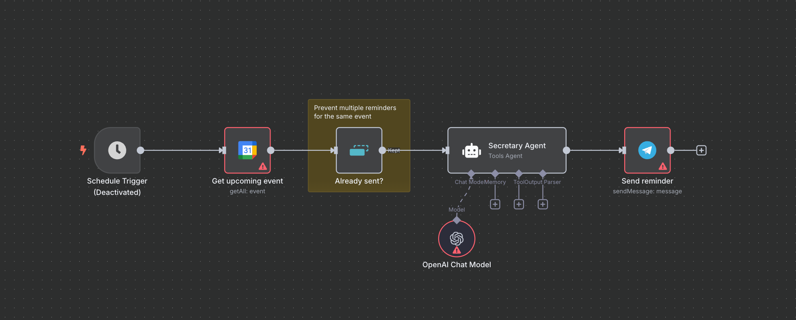

<p align="center">

</p>

# Exploring N8N and integrate with a Laravel Backend

This repo is a hybrid product of livestreaming: https://www.youtube.com/@PatricioOnCode/streams

We're exploring N8N, applying real world cases, learning fundamentals.

The end goal is to have AI, Chatbots, Automations, Workflows, alongside a Laravel App.

## Up and running

We use Laravel Sail and more Compose services.

```
Clone the repo
Composer install
Npm ci
Npm run build
Artisan key:generate
Artisan migrate:fresh --seed
```

## N8N

On the first run, we set up the user.

Email: test@example.com
// We need to use a lower and upper, plus a digit
Password: Password1

### N8N_BASE_URL

In local development, defaults to `http://n8n:5678/webhook-test`.
It needs to be enabled on the UI each time you run it.

In prod, set to `https://<url>/webhook`.
Then in can be invoked as a regular server.

# Live streams log

## Live 1

- Claude Code
- Started a local N8N instance
- Import a Workflow: it's just JSON
- Implemented a Workflow with a POST endpoint
    - Sent a payload
    - Execute JavaScript Logic
    - Respond adequately

## Live 2
- Assembling a Laravel Application with a N8N background
- We are now invoking a N8N workflow from a Laravel command
